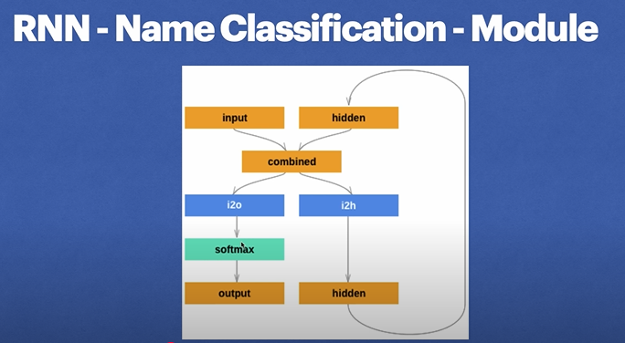
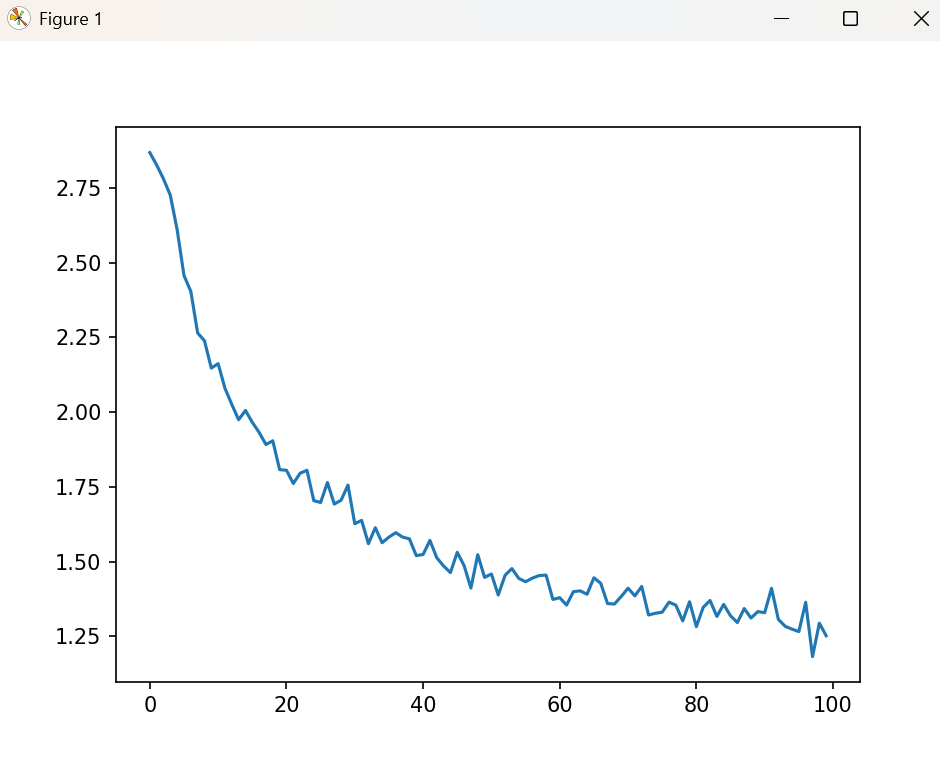

# Name Classification with RNN

This project implements a Recurrent Neural Network (RNN) using PyTorch to classify names into their respective categories based on their character sequences. The model is trained on a dataset of names from various ethnic groups and aims to predict the category of a given name.

## Table of Contents

- [Introduction](#introduction)
- [Dataset](#dataset)
- [Model Architecture](#model-architecture)
- [Training](#training)
- [Usage](#usage)
- [Dependencies](#dependencies)
- [Saving and Loading the Model](#saving-and-loading-the-model)
- [Contributing](#contributing)
- [License](#license)

## Introduction

Name classification is a common task in natural language processing (NLP) where the goal is to determine the category or origin of a name based on its spelling. This project utilizes an RNN to capture the sequential nature of characters in names, enabling the model to learn patterns associated with different categories.

## Dataset

The dataset used in this project consists of names categorized by their respective ethnic or linguistic origins. Each name is associated with a category label. The data is structured as follows:

- `category_lines`: A dictionary where keys are category names and values are lists of names belonging to that category.
- `all_categories`: A list of all category names.

## Model Architecture


The RNN model is built from scratch using PyTorch's `nn.Module`. The architecture includes:

- An input layer that takes character tensors.
- A hidden layer that maintains the state across sequences.
- An output layer that produces the probability distribution over categories.
- LogSoftmax activation for the output layer to obtain log-probabilities.

## Training



The training process involves:

1. Converting each name and its corresponding category into tensor representations.
2. Passing the character tensors through the RNN to obtain predictions.
3. Calculating the loss using Negative Log-Likelihood Loss (`nn.NLLLoss`).
4. Performing backpropagation and updating the model parameters using Stochastic Gradient Descent (SGD).

The model is trained over multiple iterations, and the loss is recorded to monitor the training progress.

## Usage

To use the trained model for predicting the category of a new name:

1. Ensure the model is loaded and set to evaluation mode.
2. Convert the input name into a tensor representation.
3. Pass the tensor through the RNN to obtain the output probabilities.
4. Determine the category with the highest probability.

Example:

```python
def predict(input_name):
    with torch.no_grad():
        line_tensor = line_to_tensor(input_name)
        hidden = rnn.init_hidden()
        for i in range(line_tensor.size()[0]):
            output, hidden = rnn(line_tensor[i], hidden)
        guess = category_from_output(output)
        return guess
```

## Author
- This project belongs to [Isaiah Essien]
- Please reach out for collaboration or expansion
